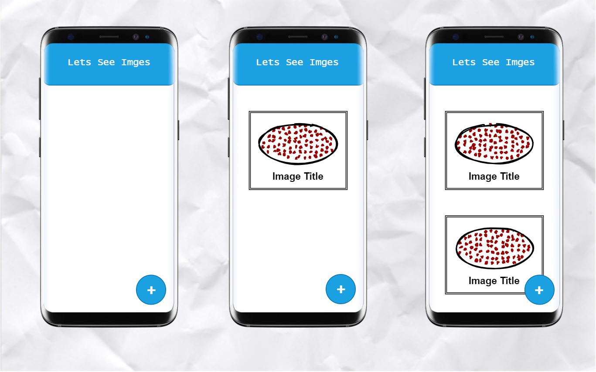

# Images App

`Flutter project`

## App Prototype 

### The four step desgin process 
* Need to import helper library from flutter to get content on the screen.
* Define a 'main' function to run when our app is starts.
* Create a new text widget to show some text on the screen.
* Tack that widget and get it on the screen.
#
