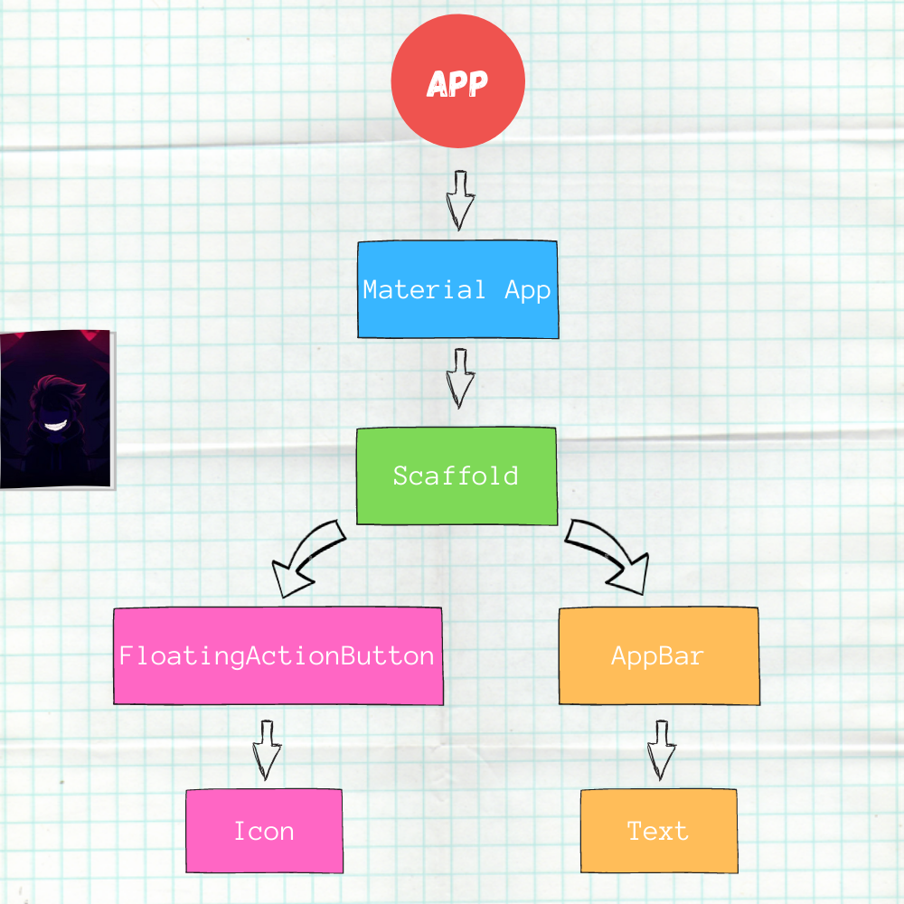

# Images App

`Flutter project`

#### fitch data from the internet 

### The four step desgin process 
* Need to import helper library from flutter to get content on the screen.
* Define a 'main' function to run when our app is starts.
* Create a new text widget to show some text on the screen.
* Take that widget and get it on the screen.
#

### App Widget Tree

